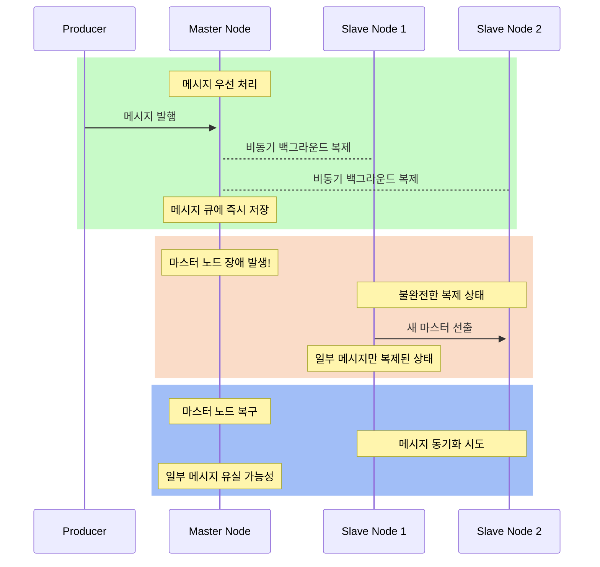
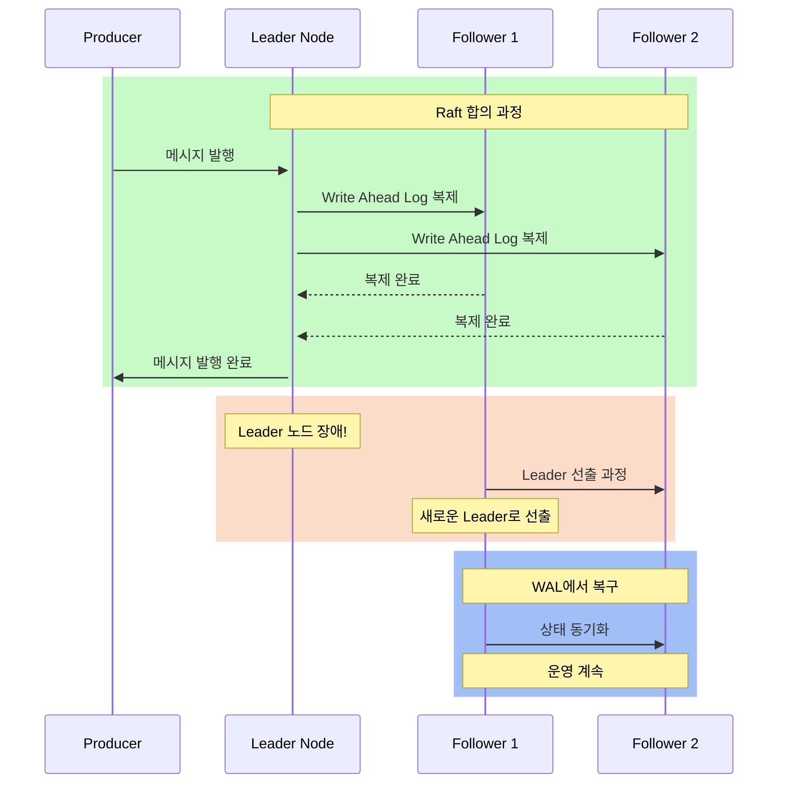

### Classic

**기본 큐 타입**으로 RabbitMQ 초기부터 제공된 전통적인 방식

- 단일 리더 구조: 하나의 노드가 큐 데이터를 저장하고 관리
- 고가용성: 미러링을 통해 복제 가능
- 장애복구 메커니즘
    - 마스터 노드 장애 감지
    - 슬레이브 중 하나가 자동으로 새 마스터로 승격
    - 기존 마스터의 모든 메시지 상속

Classic 방식은 다른 노드에 복제할 때 비동기로 복제하고 있기 때문에 메세지 손실이 발생 가능성이 높습니다

### Quorum

**고가용성과 데이터 일관성**을 중점으로 설계된 큐 타입

- **다중 리더(리플리카) 구조**: 여러 노드에 데이터를 분산 및 복제
- 고가용성: [Raft 합의 알고리즘](https://raft.github.io/) 사용

장애복구 메커니즘

- 리더 노드 장애감지
- 리더선출을 하여 팔로워노드가 리더 노드로 승격

Quorum 방식은 과반수 노드에 동시에 저장하고 있기 때문에 메세지 손실 가능성이 적습니다.

### 차이점

| **특징** | **Classic Queue** | **Quorum Queue** |
| --- | --- | --- |
| **구조** | 단일 리더 | 다중 리더 (Raft) |
| **주요 장점** | 빠른 성능, 단순함 | 고가용성, 데이터 일관성 |
| **주요 단점** | 고가용성 제한적 | 성능 저하 가능성 |
| **적합한 환경** | 소규모 메시징 시스템 | 중요한 메시지 손실 방지 필요 |
