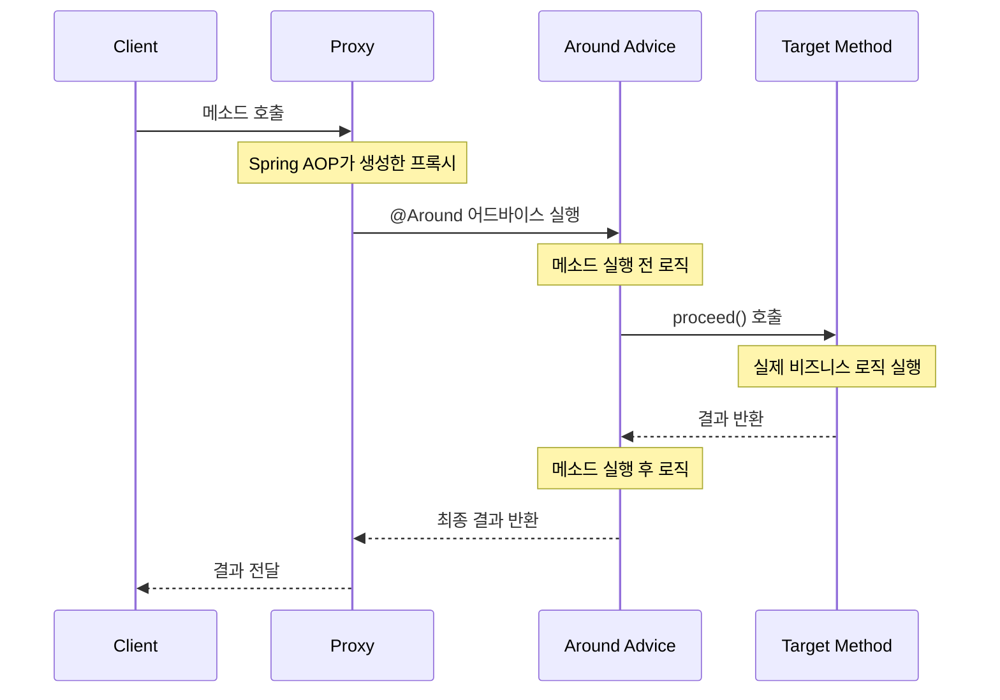

### AOP란

AOP(Aspect Oriented Programming: 관점 지향 프로그래밍)는 소프트웨어 설계 패러다임 중 하나로, 프로그램의 핵심 비즈니스 로직과 공통적으로 적용해야 하는 부가적인 기능(**로깅, 트랜잭션 관리, 보안 등**)을 분리해서 관리하는 방법입니다.

**주요 용어**
  - Aspect:
    - 공통 관심사를 구현한 모듈입니다.
    - 예: 로깅, 트랜잭션 관리, 보안 등.
  - Join Point:
    - AOP가 적용될 수 있는 지점입니다.
    - 예: 메서드 실행, 예외 처리, 필드 접근 등.
  - Advice:
    - Join Point에서 실행할 실제 로직입니다.
    - AOP가 해야 할 일을 정의하는 부분으로, 종류는 다음과 같습니다:
      - **@**Before: 메서드 실행 **이전에** 실행.
      - **@**After: 메서드 실행 **후에** 실행.
      - **@**Around: 메서드 실행 전, 실행 중, 실행 후 모든 시점에 실행.
  - Pointcut:
    - Advice를 적용할 Join Point를 필터링하는 조건입니다.
    - 예: 특정 패키지, 클래스, 메서드에만 적용.
  - Weaving:
    - AOP 코드를 애플리케이션의 비즈니스 로직에 동적으로 결합하는 과정입니다.
    - Spring은 주로 프록시 기반의 런타임 Weaving을 사용합니다.

### Mongo DB 지연 쿼리 로그 추가하기

```java
@Aspect
@Component
public class MongoDBMonitor {
	protected Logger logger = LogManager.getLogger(this.getClass());

    @Around("execution(* org.springframework.data.mongodb.core.MongoTemplate.*(..))")
    public Object logOperation(ProceedingJoinPoint joinPoint) throws Throwable {
        long startTime = System.currentTimeMillis();
        
        // {...mongo DB 쿼리에 필요 정보 추출}
        
        joinPoint.proceed();
        
        long executionTime = System.currentTimeMillis() - startTime;
        
        // 지연 시간이 특정 임계값을 초과하는 경우 경고 로그 출력
          if (executionTime > 3000) {  // 3초 이상 걸리는 쿼리에 대해 경고
              logger.error("Slow MongoDB Query Detected - Method: {}, Collection: {}, Query: {}, Execution Time: {}ms",
                                         methodName, collectionName, operationInfo, executionTime);
          }

    }

}
```

### AOP 동작 과정



### AOP 적용후 지연 쿼리 로그


MongoDB 쿼리의 지연 문제를 AOP를 적용하여 분석한 결과, count 명령어에서 7~9초 정도 지연되는 것을 확인할 수 있었습니다. 이를 통해 성능 개선의 방향을 설정할 수 있었으며, AOP를 활용하는 방법도 익힐 수 있었습니다.
